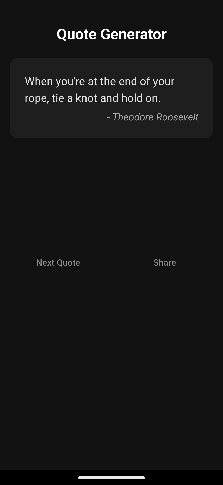

# 📜 Quote Generator

An elegant and minimal Android app built using Kotlin that fetches and displays inspirational quotes from the [ZenQuotes API](https://zenquotes.io/). Users can generate random quotes and share them easily with others.

> 🧑‍💻 Developed as part of an internship at [**Code Alpha**](https://www.codealpha.tech/).

---

## ✨ Features

- 📖 Fetches a random quote from the internet
- 🔁 Tap "Next Quote" to get a new one
- 📤 Share quotes with friends using any app
- 🌙 Dark themed UI

---

## 🛠 Tech Stack

- **Kotlin**
- **Android SDK**
- **OkHttp** – For HTTP requests
- **ZenQuotes API** – Source of random quotes

---


## 📸 Screenshots and Demo

Here’s how the app looks:



---

## 🚀 Getting Started

1. Clone the repository:
   ```bash
   git clone https://github.com/your-username/quote-generator.git
2. Set up your'e API
   ```bash
    .url("url_for_the_API")
3. Run the program
## API Reference

#### Get all items

```http
  GET /api/random
```

| Parameter | Type     | Description                |
| :-------- | :------- | :------------------------- |
| `none` | `--` | **	No parameters needed for this endpoint**. |

#### Get item

```http
  GET /api/quotes/author
```

| Parameter | Type     | Description                       |
| :-------- | :------- | :-------------------------------- |
| `name`      | `string` | **Optional**. Authors Full name |


## 📦 Dependencies

Make sure you have the following in your `build.gradle`:

```kotlin
implementation("com.squareup.okhttp3:okhttp:4.12.0")
```
## 🙌 Acknowledgements

- [ZenQuotes API](https://zenquotes.io/)
- [Code Alpha](https://www.codealpha.tech/)


## 👨‍💻 Author

####  Infernix

- [LinkedIn](https://www.linkedin.com/in/pavan-indupudi-a38759334?utm_source=share&utm_campaign=share_via&utm_content=profile&utm_medium=android_app)
- [GitHub]()


